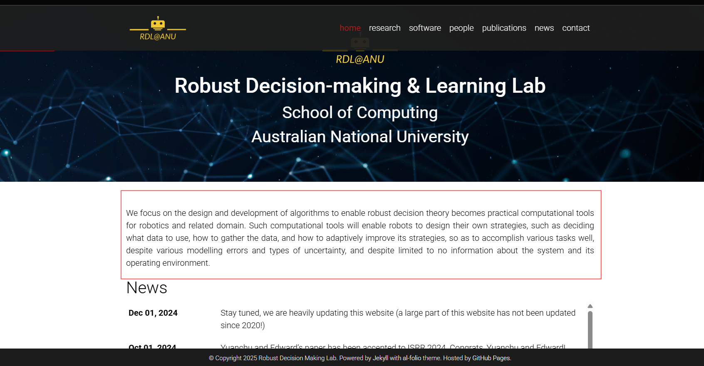
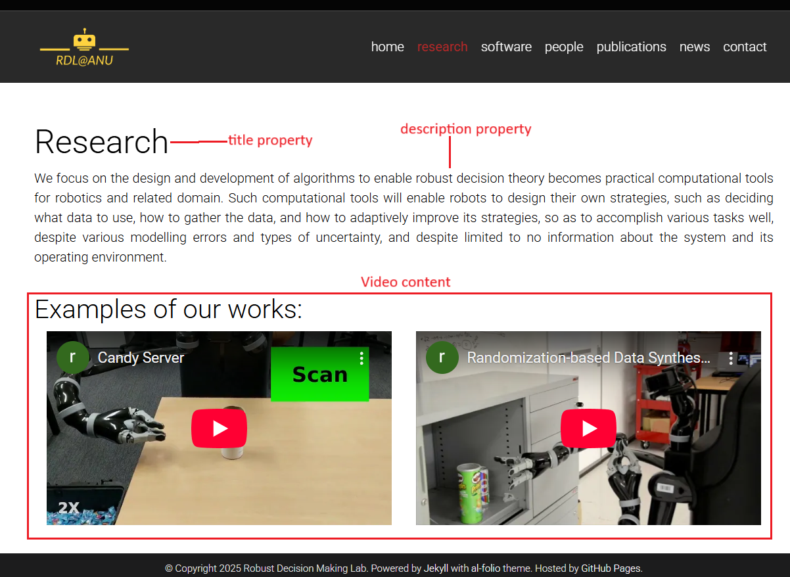
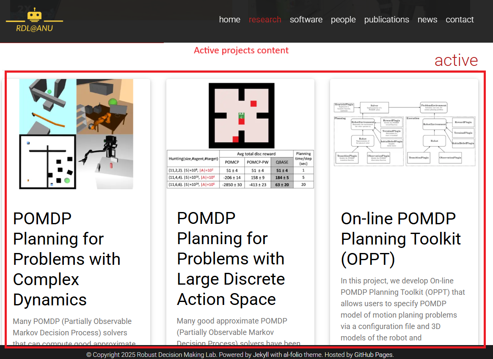
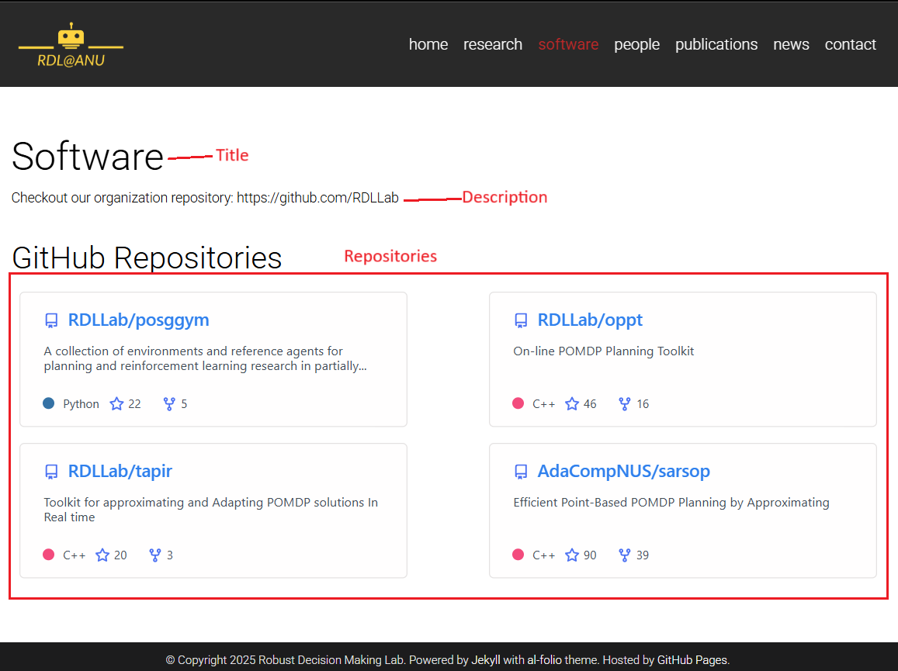

# How to setup a content.

This site is created using a template, so for general documentation to customize the website please refer to the template documentation in [README.md](/README.md). **This documentation only provide specific tutorial to change the content of each page in our updated lab website.** 

## Setup content in home page

Fig 1. show the content area in home page, to update it follow these steps:
1. Open [home.md](/_pages/home.md)
2. Edit the properties of the page (written in [font-matter](https://jekyllrb.com/docs/front-matter/) format) and the content of the page

<figure>
    
    <figcaption>Fig 1: Content area in home page is shown by red rectangle</figcaption>
</figure>

## Setup content in research page
Research page is shown in Fig 2 and 3.
<figure>
    
    <figcaption>Fig 2: Title page, description page, and videos content of research page</figcaption>
</figure>

<figure>
    
    <figcaption>Fig 3: List of projects in research page</figcaption>
</figure>

### Edit title, description, and video
1. Open the [research.md](/_pages/research.md)
2. To edit the title and description, find the 'title' and 'description' properties, then edit the text.

### Edit list of projects
Open the [_projects](/_projects/) folder, you can see list of projects. The detail of each project is described by the content of the markdown file. If you click one of the project, you will be redirected to a project detail page, which content is described by each of the markdown file corresponding to the project.

Add/Edit new project:

1. To add a new project, create a new markdown file by copying one of the already created markdown.
2. Edit the properties and the content. Explanation for each properties can be seen below.

```yaml
---
layout: page # Do not edit this
title: Partially Observed Inventory Control
description: 
img: assets/img/project_img/inventory_control/thumb-inventory-control.png
importance: 4
category: finished 
do_not_show_post_desc: true # Do not edit this
not_show: true
---
```
Project's properties explanation:

1. `title`: Title of the project
2. `description`: Short description of the project that can be seen in the research page
3. `img`: Image of the project, will be shown in research page
4. `importance`: the order of the project
5. `category`: Can be active or finished. If active, it will be shown as an active project in research page. If finished, it will be shown as a finished project.
6. `not_show`: If true, then the project will be hidden and won't be shown in research page.

## Setup content in software page

<figure>
    
    <figcaption>Fig 4: Software page</figcaption>
</figure>

1. To edit title and description, open [software.md](/_pages/software.md), then edit the title and description properties.
2. To edit the repository content, go to [repositories.yml](/_data/repositories.yml), then edit the list of repositories that you want to show.

## Setup content in people page

Go to [people.md](/_pages/people.md) and edit the properties.

## Setup content in publication page

Go to [papers.bib](/_bibliography/papers.bib) and edit list of publications that you want to show.

## Setup content in news page

Go to [_news](/_news/) directory, here you can see a list of markdown files that describe content of the each news. To edit news, just edit one of the markdown file. To add new news, just copy one of the markdown file and update it with a new content.

## Setup content in contact page

Go to [contact.md](/_pages/contact.md) and edit the properties and also the content of the page.
